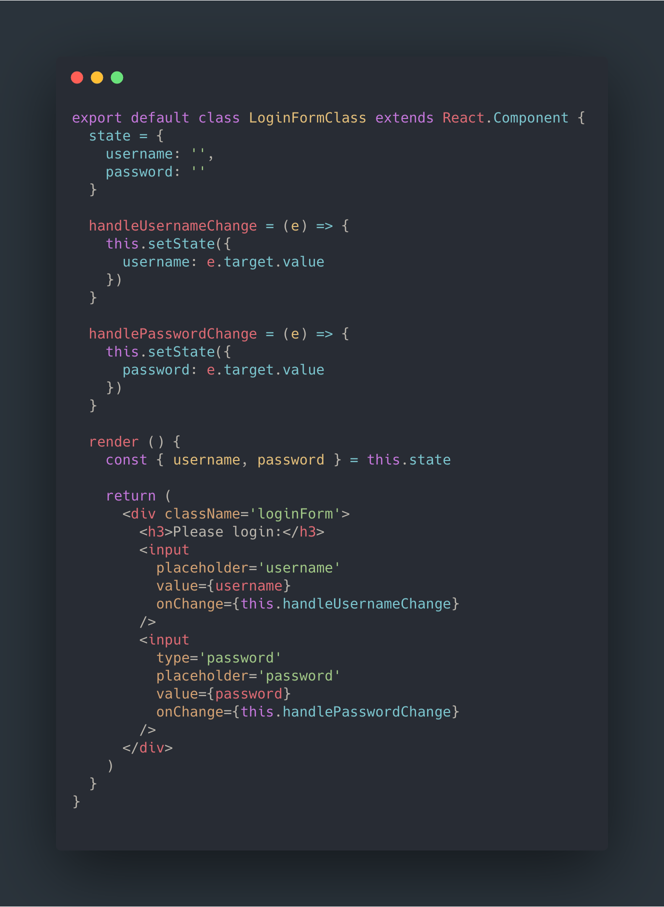
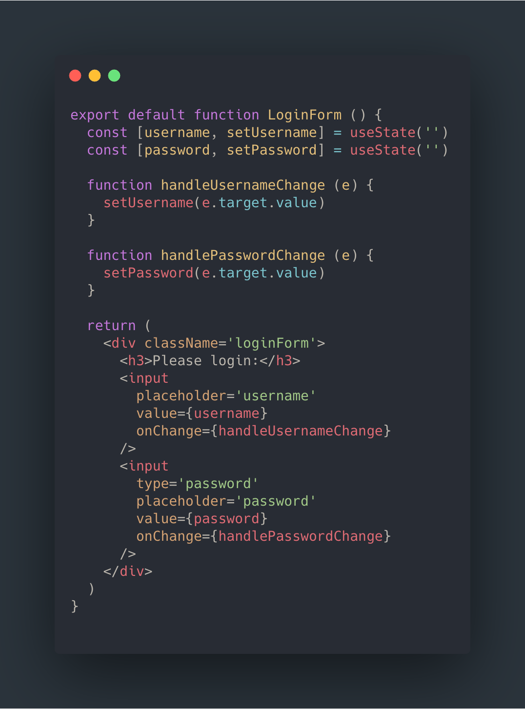
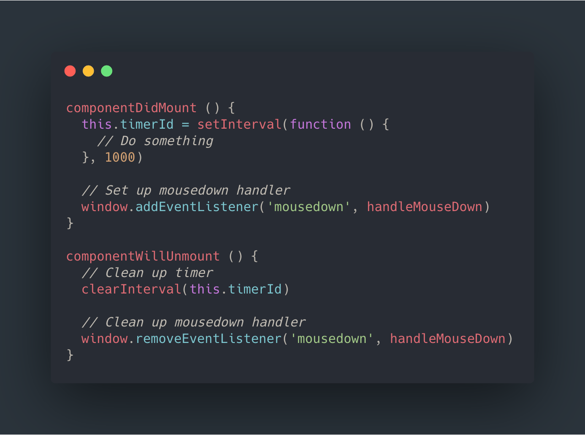
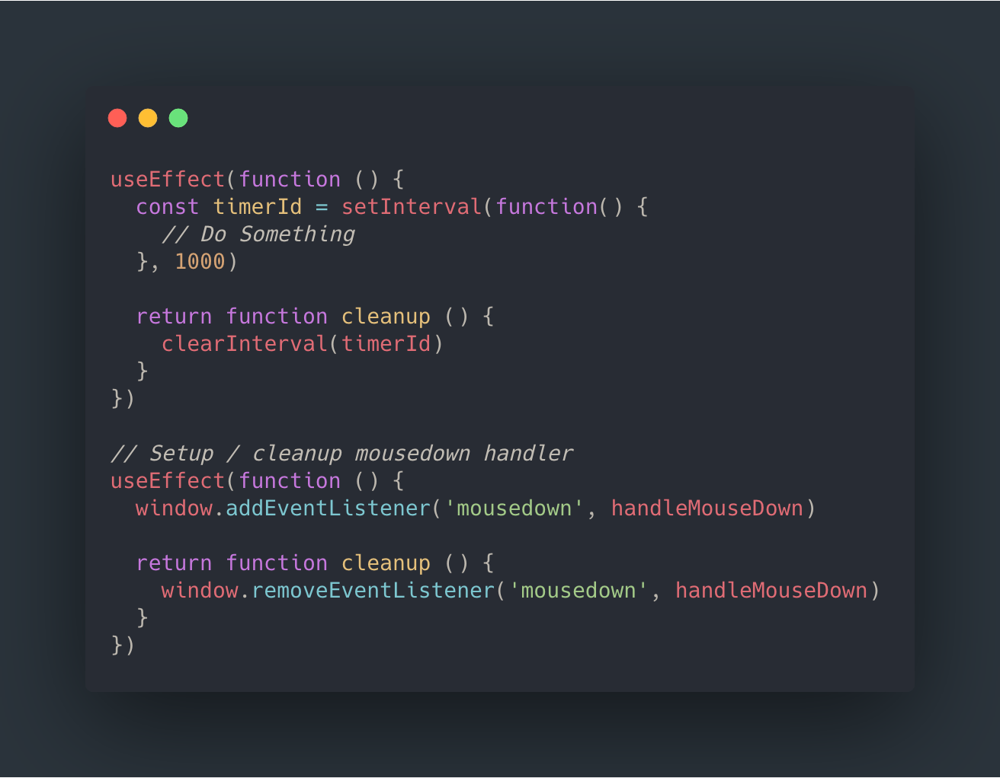
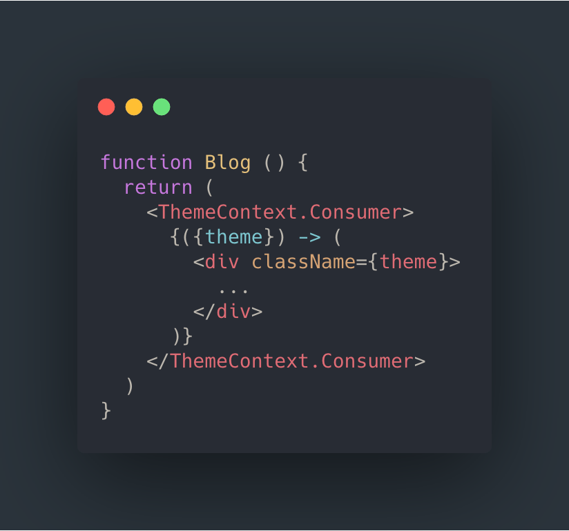
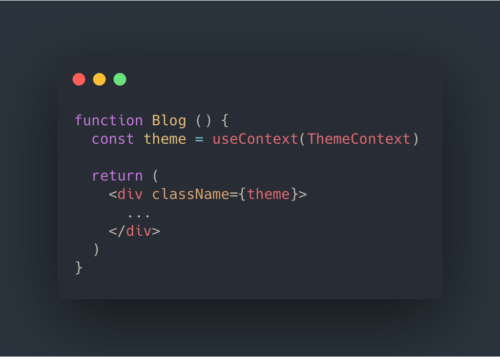
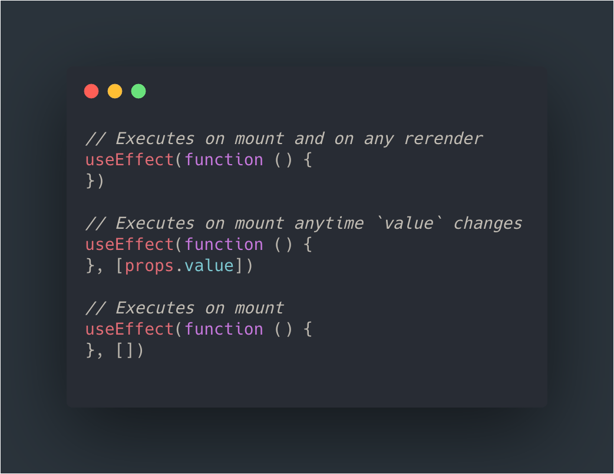
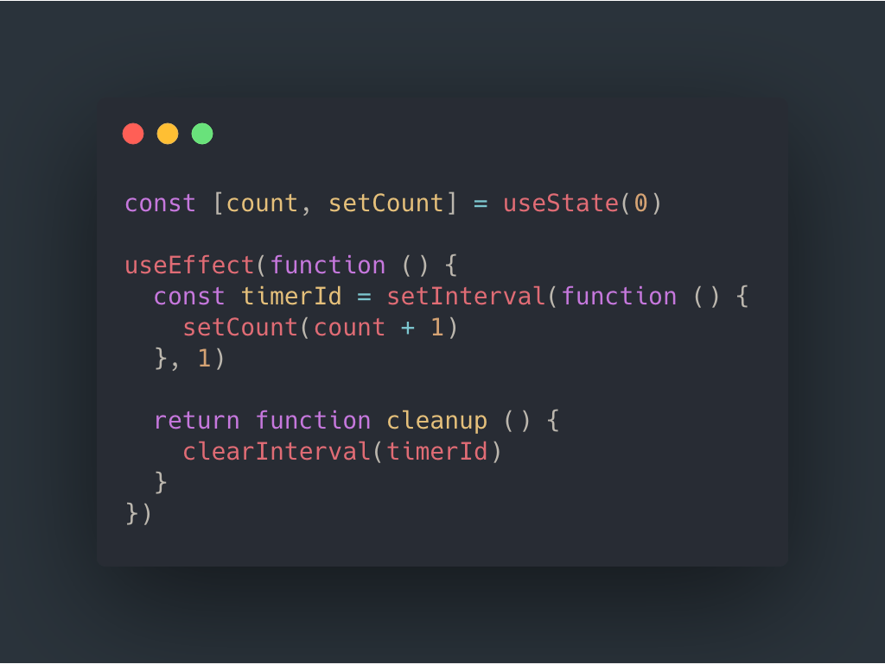
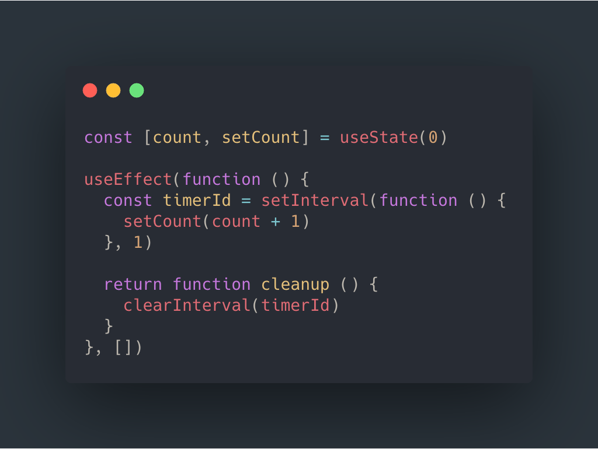
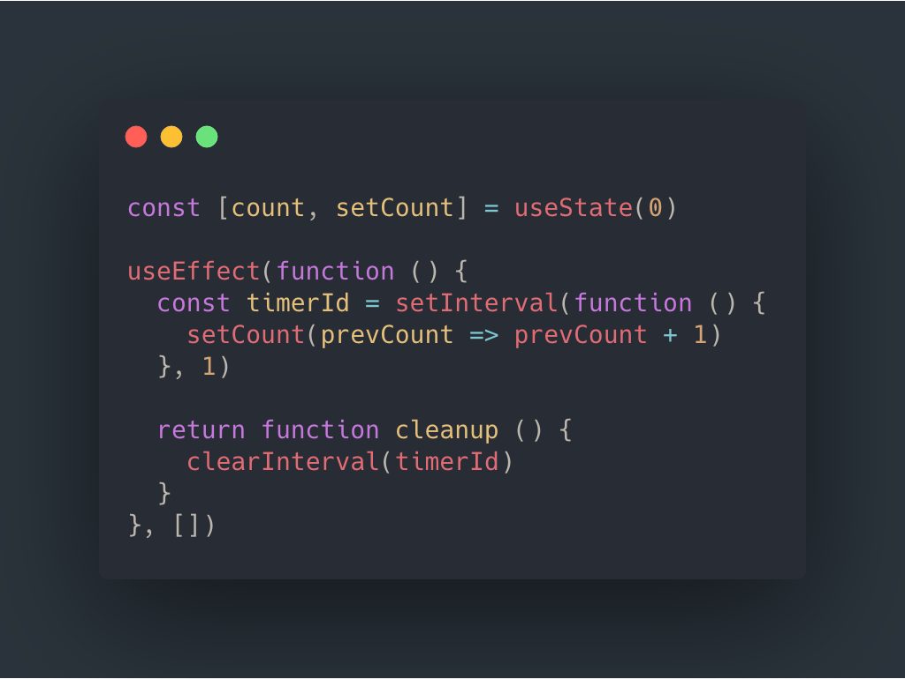

export { dark as theme } from '@mdx-deck/themes'
import { Notes } from 'mdx-deck'
import { Split } from 'mdx-deck/layouts'
import { Head, Image } from 'mdx-deck'

<Head>
  <title>Intro to Hooks</title>
</Head>

# Quick Intro to Hooks

---

  <ul>
    <li>You can now use state in function components!</li>
    <li>You can now do side-effecty things (like what you'd normally do in lifecycle methods) in function components</li>
    <li>The API is "additive" and "opt-in", class components are still supported</li>
    <li>You can create your own custom hooks</li>
  </ul>

<Notes>use custom hooks to share stateful or side-effecty code between components. No longer have to use HOC's and render props.</Notes>

---

* Live Code `useState()` and `useEffect()`

---

# What hooks are there?
* `useState`
* `useEffect`
* `useContext`

* `useReducer`, `useCallback`, `useMemo`, `useRef`, `useLayoutEffect`

---

# Things I like about hooks

---

  <ul>
    <li>All the benefits of function components over class components, without the same limitations (no state, lifecycles, etc)</li>
    <li>Less boilerplate code</li>
    <li>No dealing with the quirks of `this` keyword, binding, etc.</li>
    <li>Code just feels cleaner</li>
    <li>I think it's more beginner-friendly</li>
  </ul>

---

  

  

---

  <ul>
    <li>Ability to separate concerns in lifecycle methods</li>
    <li>Rather than grouping code by <b>when</b> it runs (on mount, on unmount, etc) you can group by <b>why</b> it runs</li>
  </ul>

---

  

  

---

  <ul>
    <li>Hooks for using Context are a lot nicer than current API's. It feels natural. Context belongs here in the hooks world.</li>
  </ul>

---

  

  

---

  <ul>
    <li>The ability to create custom / reusable hooks is badass!</li>
    <li>Cleaner way to share stateful or side-effect logic between components. No longer have HOC's or render props</li>
  </ul>

<Notes>render props or HOC add more stuff to our component tree, and they couple stateful logic with UI code, whereas hooks allow us to keep them separated</Notes>

---

`useMousePressed` Demo

---

# Tricky / Weird Things

---

The second argument to `useEffect()`: the "conditions array"

Think of it as "thepieces of data that this callback depends on"

---

  <ul>
    <li>I believe that using the "conditions array" is confusing and prone to bugs</li>
  </ul>

---

  <ul>
    <li>Use the conditions array when you actually need it, not just when you have imaginary perf worries</li>
    <li>You probably don't need to be that worried about perf. React defers running useEffect until after the browser has painted</li>
    <li>But it's good to know ways to solve perf problems the right way with the conditions array</li>
    <li><b>EXAMPLE</b></li>
  </ul>

<Notes>UseLayoutEffect gets called before paint. componentDidMount also got called before paint.</Notes>

---

No conditions array given:

Timer gets setup & torn down on every render 😕

---

The conditions array is `[]`

Timer gets setup & torn down _only_ on mount 😄

But it reverences a stale value for count 😢

---

The conditions array is `[]`

Timer gets setup & torn down _only_ on mount 😄

We use the functional update form of setState, which insures a fresh value for prevCount 😄

---

<a href="https://reactjs.org/docs/hooks-faq.html#what-can-i-do-if-my-effect-dependencies-change-too-often">
https://reactjs.org/docs/hooks-faq.html#what-can-i-do-if-my-effect-dependencies-change-too-often
</a>

---

  <ul>
    <li>It might be tempting to pass `[]` in everywhere there are no props or state referenced in the effect -- it's easier to mentally map that to a componentDidMount</li>
    <li>You have to know what you're doing, and you're signing up everyone who comes after you to maintain the conditions array</li>
    <li>“I know this could be ‘faster’” vs “but the perf for this makes no difference and fixing the imaginary perf problem will cause pain for me and future maintainers”</li>
  </ul>

---

  <ul>
    <li>I don't understand the performance implecations of certain things</li>
    <li>I still find myself thinking about components in terms of "lifecycles" rather than "effects"</li>
  </ul>

<Notes>
I don't love the API for useEffect(), specifically the second argument. it's not very self-evident. you need to pass an empty array as the second argument when you want it to run only once (super common), but this seems easy to forget and easy to overlook when reading code.
</Notes>

---

# General Concerns
* Can't define an async useEffect (there is an easy work around)
* Divisive and controversial in the React community
* Testing code that uses Hooks might have some concerns

<Notes>
You can't define an async useEffect. there is an easy workaround -- just define the async function inline and then call it immediately -- but I'm not sure how I feel about it

It has been divisive and controversial in the React community. certain library maintainers have been a little too gung-ho with converting their libraries to use Hooks, and not everyone has the time to learn a new approach like this

Apparently, testing code that uses Hooks is weird. it seems like there are ways to work through the problems (react-testing-library, etc.) but overall it requires a pretty big shift in the way of thinking about writing and testing components.
</Notes>
